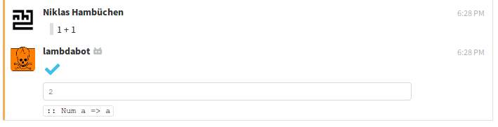

# lambdabot-zulip

A [`lambdabot`](https://wiki.haskell.org/Lambdabot)-like bot for [Zulip](https://zulipchat.com/).

Can evaluate Haskell expressions and show their types.

### Screenshot




## Usage

Run the `lambdabot-zulip-server` executable to start the bot.

It reads a `settings.yaml` in the working directory (or passed via command line).

See [`example-settings/settings.yaml`](example-settings/settings.yaml) for an example.
You have to provide Zulip API credentials, and streams (channels) the bot should be active on.

## Systemd unit

For the simple case that you want to run this in a small throwaway VM server as `root`, here's a systemd unit file.

It assumes that you have the repo cloned at `/root/lamdabot-zulip` and did `stack build` in there.

Put this into `/etc/systemd/system/lambdabot-zulip-server.service`:

```
[Unit]
Description=Lambdabot Zulip server
After=syslog.target network.target
StartLimitIntervalSec=0

[Service]
ExecStart=/usr/local/bin/stack "exec" "lamdabot-zulip-server"
WorkingDirectory=/root/lambdabot-zulip
Restart=always
Environment="HOME=/root"
MemoryMax=1G

[Install]
WantedBy=multi-user.target
```

Note that you can't `ExecStart` the executable directly due to https://github.com/gwern/mueval/issues/16#issuecomment-448707773.

To load the service and have it start at boot:

```
systemctl daemon-reload
systemctl enable lambdabot-zulip-server
systemctl start lambdabot-zulip-server
```
